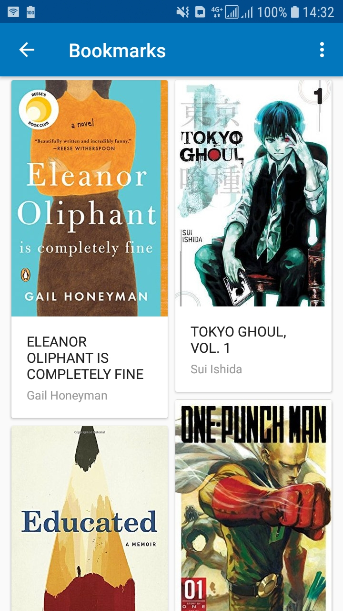

# Bookworm

An Android Application to show details on the best-selling books based on the New York Times ratings

   


## Getting Started

To run this project, do the following:

1. Clone the project
2. Open the project from `Android Studio`
3. Get an API_KEY for books api from [here](https://developer.nytimes.com/docs/books-product/1/overview)
4. Add it to your ~/.gradle/gradle.properties as NewYorkimesApiKey="<API KEY>"

Get the latest APK release [here](https://github.com/EddyMM/bookworm/releases)

### Prerequisites

- Android Studio IDE
- Gradle


### Installing

- Clone the project

```
git clone https://github.com/EddyMM/bookworm.git
```

- Open project using `Android Studio`
- Sync with gradle files to get the necessary dependencies
- Run the project using emulator or connected Android Device


## Built With

- Android SDK
- Gradle - Dependency Management
- Retrofit as a REST client library
- Picasso for image loading and caching 
- FirebaseAuth - User Authentication
- FirebaseDatabase - Data persistence


## Contributing

1. Fork it
2. Create your feature branch (git checkout -b my-new-feature)
3. Commit your changes (git commit -m 'Add some feature')
4. Push your branch (git push origin my-new-feature)
5. Create a new Pull Request


## Authors

* **Eddy Mwenda Mwiti**  - [EddyMM](https://github.com/EddyMM)

## License

This project is licensed under the MIT License - see the [LICENSE.md](LICENSE.md) file for details
